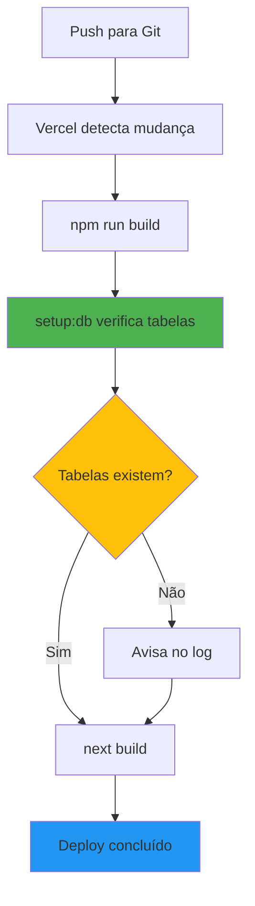

# 🚀 Deploy Automático no Supabase

Este documento explica como funciona o processo de deploy automático do banco de dados no Supabase quando você faz deploy na Vercel.

## Como Funciona

### 1️⃣ Setup Automático Durante o Build

Quando você faz deploy na Vercel, o seguinte processo acontece automaticamente:

```bash
npm run build
  → npm run setup:db  # Verifica e configura o banco
  → next build        # Compila o projeto
```

O script `setup-database.js` executa automaticamente e:
- ✅ Verifica conexão com o Supabase
- ✅ Checa se as tabelas existem
- ✅ Cria o bucket de storage se necessário
- ⚠️ Avisa se algo estiver faltando (mas não quebra o build)

### 2️⃣ Primeira Vez - Criar Tabelas

**Na primeira vez**, você precisa criar as tabelas manualmente no Supabase:

1. Acesse o [Supabase Dashboard](https://supabase.com/dashboard)
2. Selecione seu projeto
3. Vá em **SQL Editor** (menu lateral)
4. Clique em **New Query**
5. Copie todo o conteúdo do arquivo `scripts/supabase-schema.sql`
6. Cole no editor e clique em **Run**

### 3️⃣ Migração de Dados (Apenas uma vez)

Depois de criar as tabelas, se você tem dados no SQLite local para migrar:

```bash
npm run migrate
```

Este comando:
- Lê os dados do `cinema.db` (SQLite)
- Envia para o Supabase
- Faz upload das imagens para o Storage

## Scripts Disponíveis

### `npm run setup:db`
Verifica se o banco está configurado corretamente. Executado automaticamente durante o build na Vercel.

### `npm run migrate`
Migra dados do SQLite local para o Supabase. Execute apenas uma vez localmente.

### `npm run build`
Executa o setup do banco + build do Next.js. Usado pela Vercel.

## Configuração na Vercel

### Variáveis de Ambiente

Configure estas variáveis no dashboard da Vercel:

```env
NEXT_PUBLIC_SUPABASE_URL=https://seu-projeto.supabase.co
NEXT_PUBLIC_SUPABASE_ANON_KEY=sua-chave-publica
SUPABASE_SERVICE_ROLE_KEY=sua-chave-privada
JWT_SECRET=seu-segredo-jwt
```

**Como adicionar na Vercel:**
1. Vá em Settings → Environment Variables
2. Adicione cada variável
3. Marque para usar em Production, Preview e Development
4. Clique em Save

### Build Command

A Vercel detecta automaticamente o comando de build do `package.json`:

```json
"build": "npm run setup:db && next build"
```

**Não precisa configurar nada manualmente!** A Vercel vai usar este comando automaticamente.

## Fluxo de Deploy



## Estrutura de Arquivos

```
CinemaSite/
├── scripts/
│   ├── setup-database.js       # ✅ Verifica DB no build (automático)
│   ├── migrate-to-supabase.js  # 📦 Migra dados SQLite → Supabase
│   └── supabase-schema.sql     # 📋 Schema das tabelas
├── package.json                # Configurado com script de setup
└── .env.local                  # Variáveis de ambiente (local)
```

## Checklist de Deploy

- [ ] **Primeira vez**:
  - [ ] Criar projeto no Supabase
  - [ ] Executar `supabase-schema.sql` no SQL Editor
  - [ ] Adicionar variáveis de ambiente na Vercel
  - [ ] (Opcional) Rodar `npm run migrate` localmente

- [ ] **Deploys seguintes**:
  - [ ] Apenas fazer push para o Git
  - [ ] Vercel executa tudo automaticamente! 🎉

## Troubleshooting

### ❌ "Could not find the table 'public.xxx' in the schema cache"

**Problema:** As tabelas não foram criadas no Supabase.

**Solução:** Execute o arquivo `scripts/supabase-schema.sql` no SQL Editor do Supabase (veja seção 2️⃣ acima).

### ❌ "Error: EISDIR: illegal operation on a directory"

**Problema:** Script tentando ler um diretório como arquivo.

**Solução:** ✅ Já corrigido! O script agora ignora diretórios automaticamente.

### ❌ Build falha na Vercel

**Problema:** Variáveis de ambiente não configuradas.

**Solução:** Verifique se todas as variáveis estão configuradas em Settings → Environment Variables.

### ⚠️ "Tabelas faltando detectadas"

**Problema:** Aviso durante o build, mas não quebra o deploy.

**Solução:** Execute o schema SQL no Supabase. O site pode não funcionar corretamente sem as tabelas.

## Monitoramento

Para ver os logs do script durante o deploy:

1. Acesse o dashboard da Vercel
2. Vá em Deployments
3. Clique no deploy mais recente
4. Veja a seção "Build Logs"

Procure por:
- `🚀 Verificando configuração do banco de dados...`
- `✅ Todas as tabelas já existem!`
- `✅ Bucket "uploads" existe`

## Notas Importantes

- 🔒 **Segurança**: O `SUPABASE_SERVICE_ROLE_KEY` é usado apenas no servidor (nunca enviado ao cliente)
- 🔄 **Automático**: Após o setup inicial, tudo acontece automaticamente
- 📦 **Storage**: O bucket "uploads" é criado automaticamente se não existir
- ⚡ **Performance**: O script é rápido e não impacta o tempo de build significativamente

## Próximos Passos

Após o deploy bem-sucedido:

1. ✅ Acesse seu site na URL da Vercel
2. ✅ Teste o login no `/admin`
3. ✅ Verifique se os posts aparecem na home
4. ✅ Teste upload de imagens

---

**Dúvidas?** Verifique os logs do build na Vercel ou os logs do Supabase Dashboard.
